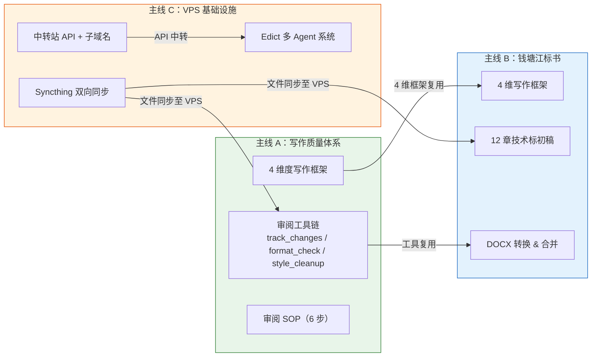

# 周末工作主线地图（3/13 - 3/14）

## 怎么读这份文件

这份文件记录了 3/13-3/14 两天内通过 Claude Code 完成的全部工作，按 **三条主线** 组织：

- **主线 A（写作质量体系）** — 从一次报告对比出发，提炼出写作维度框架（最终统一为 4 维度），落地为审阅 SOP 和工具链。这是方法论的源头。
- **主线 B（钱塘江标书）** — 一天内完成 12 章技术标初稿。直接消费了主线 A 的 4 维度框架和工具链。
- **主线 C（VPS 基础设施）** — 搭建同步、中转、代理等基础设施，让 A/B 的产出能被远程系统访问。

**阅读建议**：先看下方的 Mermaid 关联图理解三条线的依赖关系，再按兴趣深入单条主线。每条主线内部按时间顺序排列，产出清单用表格汇总，关键决策用引用块标注。

---

## 主线关联总览



**三条关联路径**：

| 编号 | 从 | 到 | 说明 |
|------|-----|-----|------|
| 1 | A 的 4 维度框架 | B 的标书写作 | 4 维框架直接复用：D1 来龙去脉、D2 乙方立场与措辞、D3 报告结构、D4 预判评审 |
| 2 | A 的审阅工具链 | B 的 DOCX 转换 | `docx_track_changes.py` 等工具在标书流程中直接复用 |
| 3 | C 的 Syncthing | A/B 的产出文件 | Work/zdwp、Personal/essays 等目录双向同步至 VPS，供 Edict 系统访问 |

---

## 主线 A：写作质量体系（eco-flow 生态流量项目）

**时间**：3/13 - 3/14
**一句话**：从一次报告对比中发现差距，提炼出维度框架，开发工具链，落地为可复用的审阅 SOP。

### 事件时间线

#### 1. Word 审阅修订脚本开发

开发 `docx_track_changes.py`，包含 `read`（读取修订）和 `review`（写入修订）两个命令。

- 初版 730 行，包含字体规范化功能
- 想清楚审阅脚本只管修订标记，字体规范化应该分离
- 精简至 300 行，职责单一

#### 2. 报告对比：戴欢 vs 曾田力

对比同一份报告的两个版本，发现自己与资深同事戴欢的写作差距。这次对比是整个写作质量体系的触发点。

#### 3. 提炼 4 维度写作框架

从对比中总结出写作质量框架，经迭代最终统一为 4 个维度：

| 维度 | 名称 | 一句话 |
|------|------|--------|
| D1 | 来龙去脉 | 数据和事情的前因后果讲清楚了吗 |
| D2 | 乙方立场与措辞 | 责任给甲方/上级，我们不接 |
| D3 | 报告结构 | 先现状后方案，汇总一一对齐 |
| D4 | 预判评审 | 专家会问什么 |

> **演进说明（已统一为4维度）**：最初从报告对比中提炼了6个维度（D1-D6），后经实践发现维度重叠，最终浓缩为 4 个维度。详见 `实战-写作质量体系.md` 第二章。


#### 4. 戴欢 163 条修订的 8 类拆解

对戴欢的 163 条修订逐一分类为 8 类，发现：

> **关键发现**：戴欢七成精力花在 D1（来龙去脉）。这说明"有没有交代清楚前因后果"是报告质量的最大短板，也是最值得优先提升的维度。

#### 5. 多 Agent 按章节审阅

用多 Agent 模式对报告进行 4 维度审阅：

> **关键决策**：按章节拆分给不同 Agent，而不是按维度拆分。原因是每个 Agent 需要完整理解章节上下文才能做出准确判断，按维度拆会丢失语境。

产出 `0312_reviewed.docx`（19 条修订 + 19 条批注）。

#### 6. 术语统一（审阅实践补充）

在审阅实践中发现术语不一致是高频问题，作为审阅检查项补充（已统一为 4 维度后，术语统一归入 D3 预判评审的检查范畴）：

| 检查项 | 代号 | 含义 | 说明 |
|--------|------|------|------|
| 术语统一 | Terminology | 术语一致性 | 全文术语、缩写、表述保持一致 |

#### 7. 格式保护工具开发

CC 审阅操作破坏了页眉页脚和字体，催生了两个新工具：

- `docx_format_check.py` — 格式快照（snapshot）与对比（compare），审阅前后各拍一次快照，自动发现格式变化
- `docx_style_cleanup.py` — 样式清理，将 89 个样式精简到 23 个

#### 8. 审阅 SOP 落地（6 步流程）

将整个流程固化为标准操作流程（SOP），确保可复用。

#### 9. Skill 整理

| Skill | 内容 |
|-------|------|
| `docx-review` | 审阅 SOP（6 步流程完整收录） |
| `report-writing` | 4 维写作质量框架 |
| `zdwp-eco-flow` | 充实景宁项目经验 |

### 产出清单

| 类型 | 产出 | 说明 |
|------|------|------|
| 脚本 | `docx_track_changes.py` | Word 修订标记读写（read/review 两命令） |
| 脚本 | `docx_format_check.py` | 格式快照与对比（snapshot/compare） |
| 脚本 | `docx_style_cleanup.py` | 样式清理（89→23 个样式） |
| Skill | `docx-review` | 审阅 SOP |
| Skill | `report-writing` | 4 维写作框架 |
| Skill | `zdwp-eco-flow` | 景宁经验充实 |
| 学习文档 | 戴欢 8 类修改拆解 | 163 条修订的分类分析 |
| 学习文档 | 标书 vs 报告区别 | 两种文体的差异总结 |

### 关键决策汇总

> **决策 1**：审阅脚本只管修订标记，不管字体规范化 — 职责单一原则，730 行精简到 300 行。

> **决策 2**：按章节拆分 Agent，不按维度拆分 — 保留上下文完整性。

> **决策 3**：术语统一纳入审阅检查 — 实践中发现术语不一致是高频问题，归入 D3 预判评审的检查范畴。

---

## 主线 B：钱塘江标书全流程（zdwp 标书项目）

**时间**：3/14（一天内完成）
**一句话**：一天内完成 12 章技术标初稿，从招标拆解到最终 DOCX 合并，全程用 Agent 并行 + 脚本标准化。

### 事件时间线

#### 1. 招标文件拆解

| 项目 | 数值 |
|------|------|
| 总分 | 100 分 |
| 用户可控 | 52 分（技术 44 + 管理 8） |
| 章节数 | 12 章对应 12 项评分 |

#### 2. 复用 4 维度框架

直接复用主线 A 统一的 4 维度框架：

| 维度 | 名称 | 标书场景适配 |
|------|------|-------------|
| D1 | 来龙去脉 | 直接对应 |
| D2 | 乙方立场与措辞 | 标书中立场和措辞尤其重要 |
| D3 | 报告结构 | 标书章节必须对齐评分标准 |
| D4 | 预判评审 | 标书场景下预判对象是评审专家 |

#### 3. 三 Agent 并行写 12 章初稿

3 个 subagent 并行，每个负责 4 章，完成全部 12 章技术标初稿。

> **关键决策**：主会话只做调度，文字写作全部派 subagent。主会话保持全局视野，不陷入具体写作。

#### 4. Bullet Point 全转段落/表格

> **关键决策**：公文写作禁止 bullet point。所有 bullet list 必须转为段落叙述或表格呈现。

开发 `bullet_to_paragraph.py` 处理批量转换。

#### 5. 结构标准化脚本

开发 `bid_standardize.py`，包含 6 项结构标准化规则，确保 12 章风格统一。

#### 6. 图表生成系统

| 脚本 | 功能 |
|------|------|
| `chart_gantt.py` | 甘特图生成 |
| `chart_bar.py` | 柱状图生成 |
| `chart_flow.py` | 流程图生成 |
| `chart_common.py` | 图表公共模块 |
| `chart_insert.py` | 图表插入 DOCX |

#### 7. MD 工作流目录链

建立三级目录流水线：

```
md/          原始 MD（Agent 产出）
  ↓ 清洗
md_clean/    清洗后 MD（去掉格式问题）
  ↓ 终审
md_final/    终版 MD（准备转 DOCX）
```

#### 8. 表格标准化

发现 89 个表格全部没有表名。5 个 subagent 并行为所有表格补充表名。

开发辅助工具：
- `table_name_check.py` — 检查表格是否有表名
- `fix_table_order.py` — 修复表格编号顺序

#### 9. 重大安全事故：投标单位名称泄露

> **安全事故**：subagent 在技术标中写入了投标单位名称"杭州市水文水资源监测中心"，共 110 处。技术标评审是匿名的，出现投标单位名称会导致废标。紧急全文清理。

> **事后规则**：标书中不得出现投标单位任何信息。这条规则必须写入 Skill 约束。

#### 10. 最终合并

生成 `merged.docx`，完成全部 12 章技术标。

### 产出清单

| 类型 | 产出 | 说明 |
|------|------|------|
| 文档 | 12 章技术标完整初稿 | merged.docx |
| 脚本 | `bid_standardize.py` | 6 项结构标准化 |
| 脚本 | `bullet_to_paragraph.py` | Bullet 转段落/表格 |
| 脚本 | `chart_gantt.py` | 甘特图生成 |
| 脚本 | `chart_bar.py` | 柱状图生成 |
| 脚本 | `chart_flow.py` | 流程图生成 |
| 脚本 | `chart_common.py` | 图表公共模块 |
| 脚本 | `chart_insert.py` | 图表插入 DOCX |
| 脚本 | `table_name_check.py` | 表格表名检查 |
| 脚本 | `fix_table_order.py` | 表格编号修复 |
| 脚本 | `md_docx_template.py`（修复版） | MD→DOCX 转换 |

### 关键决策汇总

> **决策 1**：三级优先级 — 脚本 > Skill(CC+约束) > CC 直接。能用脚本固化的不靠 Skill，能用 Skill 约束的不靠 CC 临场发挥。

> **决策 2**：主会话只调度，文字写作派 subagent — 保持全局视野。

> **决策 3**：公文写作禁止 bullet point — 全部转段落或表格。

> **决策 4**：标书中不得出现投标单位任何信息 — 安全事故后的铁律。

> **决策 5**：统一使用 4 维度框架 — D1 来龙去脉、D2 乙方立场与措辞、D3 报告结构、D4 预判评审。

---

## 主线 C：VPS 基础设施（vps 项目）

**时间**：3/13
**一句话**：搭建 VPS 基础设施，包括代理、同步、中转、域名，为后续远程协作打基础。

### 事件时间线

#### 1. OpenClaw + pnpm 安装

VPS 上安装 OpenClaw 和 pnpm，配置中转站 API，为 Claude Code 远程调用提供基础。

#### 2. 飞书机器人

创建企业自建应用"AI 助手"，完成飞书机器人配置，用于后续消息通知。

#### 3. Edict 多 Agent 系统

唤醒和迁移 Edict 系统 — 12 个古廷架构 Agent 的多 Agent 系统。

#### 4. Syncthing 双向同步

配置 4 个目录的双向同步：

| 目录 | 说明 |
|------|------|
| `Work/zdwp` | 水利项目文件 |
| `Personal/essays` | 论文部 |
| `Learn` | 学习笔记 |
| `Work/reports` | 工作报告 |

> **关键意义**：这 4 个目录同步后，VPS 上的 Edict 系统可以直接访问本地的工作文件，实现远程协作闭环。

#### 5. 子域名规划 + Nginx + CF Origin Rule

| 子域名 | 用途 |
|--------|------|
| `panel.*` | 管理面板 |
| `board.*` | 看板 |
| `sub.*` | 订阅 |

配置 Nginx 反向代理和 Cloudflare Origin Rule。

#### 6. 端口分配

> **关键决策**：443 端口给 Xray Reality（代理流量），Web 服务走 8443。代理流量优先级更高，必须占用标准 HTTPS 端口以降低被检测风险。

#### 7. Shadowrocket 规则重构

用 RULE-SET 替代手动维护规则，降低维护成本。

#### 8. DNS 迁移

域名 `tianlizeng.cloud` 的 DNS 从原注册商迁移至 Cloudflare，统一管理。

### 产出清单

| 类型 | 产出 | 说明 |
|------|------|------|
| 服务 | OpenClaw + 中转站 API | Claude Code 远程调用基础 |
| 服务 | 飞书机器人"AI 助手" | 消息通知通道 |
| 服务 | Edict 多 Agent 系统 | 12 个古廷架构 Agent |
| 服务 | Syncthing 4 目录同步 | 本地↔VPS 双向同步 |
| 配置 | Nginx + 子域名 | panel/board/sub 三个子域名 |
| 配置 | Xray Reality（443） | 代理服务 |
| 配置 | Shadowrocket RULE-SET | 规则集替代手动维护 |
| 配置 | Cloudflare DNS | 域名统一管理 |

### 关键决策汇总

> **决策 1**：443 给 Xray，Web 走 8443 — 代理伪装需要标准端口。

> **决策 2**：Shadowrocket 用 RULE-SET — 告别手动维护，规则可远程更新。

> **决策 3**：DNS 迁至 Cloudflare — 统一管理，配合 Origin Rule 和 CDN。

---

## 认知升级路径（合并自 tw93 Ch12）

### 第一阶段：功能使用者

把 CC 当搜索引擎或文字处理器。"帮我写第 3 章"、"帮我改这段话"。CC 输出质量不稳定，不知道为什么有时好有时差。

### 第二阶段：流程优化者

开始思考"怎么让输出更稳定"。写 CLAUDE.md 约束行为、用 Skill 固定流程、prompt 模板化。

**关键转变**：从"希望 CC 聪明一点"变成"我来设计约束让 CC 不出错"。

**分水岭**：你开始写 CLAUDE.md 的那一刻。

### 第三阶段：系统设计者

把 CC 作为更大系统的组件来设计。不只是"CC 怎么用"，而是"CC 在整个工作系统中扮演什么角色"。

**关键转变**：从"人 + CC"二元关系，变成"人 + CC + 脚本 + Hook + 远程 Agent + 文件同步"的系统架构。

**分水岭**：标书泄露事故 —— prompt 级约束不够，必须用系统级机制（Hook、脚本扫描）保证安全。

### 核心经验

1. **约束 > 能力**：CC 再聪明，没有约束就会犯错。明确告诉它什么不能做，最好用系统机制强制执行。
2. **问题发现后立刻固化为工具**：发现 89 张表没表名 → 写 `table_name_check.py`；发现审阅破坏格式 → 写 `docx_format_check.py` snapshot/compare。
3. **上下文质量 > 模型智力**：给 CC 的素材有多好，比 CC 本身有多聪明更重要。

---

## 附：数字总览

| 指标 | 数值 |
|------|------|
| 总时间跨度 | 2 天（3/13-3/14） |
| 主线数量 | 3 条 |
| 新开发脚本 | 14 个 |
| Skill 新建/更新 | 3 个 |
| 技术标章节 | 12 章 |
| 写作维度演进 | 最终统一为 4 维度（D1 来龙去脉、D2 乙方立场与措辞、D3 报告结构、D4 预判评审） |
| Agent 并行峰值 | 5 个 subagent（表格标准化阶段） |
| 安全事故 | 1 次（投标单位名称泄露，110 处清理） |
| VPS 服务部署 | 4 项 |
| Syncthing 同步目录 | 4 个 |
